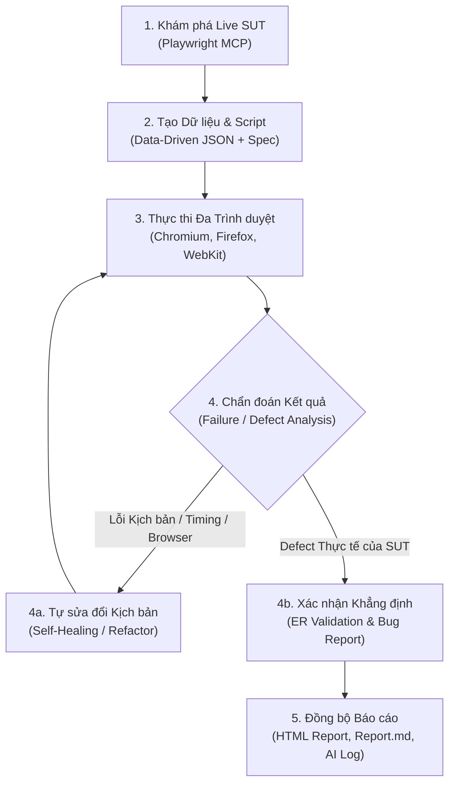

# Quy trình Tự động hóa Toàn diện: Playwright MCP End-to-End Automation Workflow

Kỹ năng này thiết lập **Vòng đời Tự động hóa Toàn diện (Closed-Loop Automation Workflow)** từ khâu khám phá ứng dụng thực tế, tạo mã kịch bản và dữ liệu, thực thi kiểm thử đa trình duyệt, tự động chẩn đoán lỗi & hiệu chỉnh kịch bản (Self-Healing), đến đồng bộ tài liệu và báo cáo kiểm định AI.



---

## 1. Mục tiêu & Nguyên tắc Cốt lõi

1. **Khám phá Hộp đen Khách quan (Black-Box Live Exploration):** Tương tác với ứng dụng thực tế thông qua bộ công cụ Playwright MCP (`browser_navigate`, `browser_snapshot`, `browser_click`, `browser_fill_form`, `browser_evaluate`). Không kiểm tra source code nội bộ của ứng dụng để giữ tính khách quan.
2. **Chuẩn hóa Data-Driven Testing (DDT):** Tách biệt 100% dữ liệu đầu vào và kết quả kỳ vọng sang tệp `.json` độc lập. Không hardcode mảng dữ liệu nội dòng trong kịch bản.
3. **Đa dạng hóa Mẫu Khẳng định ($\ge 3$ Assertion Patterns):** Sử dụng tối thiểu 3 mẫu khẳng định (Visibility, Count, RegExp, Numeric Boundary, Security Dialog, HTTP Status).
4. **Tương thích Đa Trình duyệt Hoàn hảo (Multi-Browser Resilience):** Xử lý triệt để các đặc thù về lập lịch microtask, dropped-click, hydration delay và network timing trên **Chromium, Firefox, và WebKit**.
5. **Tự sửa đổi & Khép kín Quy trình (Self-Healing & Closed-Loop):** Tự động phát hiện lỗi kiểm thử tự động (False Positive, Timeout, Race Condition) để tái cấu trúc kịch bản và phân biệt rõ ràng với Defect thực tế của phần mềm.

---

## 2. Quy trình Thực hiện 5 Giai đoạn Chi tiết

### 🟢 GIAI ĐOẠN 1: Khám phá Ứng dụng Trực tiếp bằng Playwright MCP
1. Điều hướng đến URL mục tiêu bằng `browser_navigate`.
2. Kiểm tra trạng thái DOM và phần tử bằng `browser_snapshot` hoặc `browser_evaluate`.
3. Thực hiện tuần tự các bước nghiệp vụ của từng Test Case (nhập liệu, click, toggle, submit).
4. Chụp snapshot sau mỗi thao tác để ghi nhận selector ổn định (`getByRole`, `getByPlaceholder`, `getByText`).

---

### 🟡 GIAI ĐOẠN 2: Khởi tạo Dữ liệu Data-Driven & Kịch bản Kiểm thử

1. **Khởi tạo Tệp Dữ liệu JSON (`data/frXX_data.json`):**
   * Chứa cấu hình chung (`feature`, `baseUrl`, `credentials`).
   * Mỗi test case là một object định danh rõ `caseId`, `title`, `input`, `expectedResult`.
2. **Tạo Tệp Kịch bản Playwright Test (`test/fr_XX.spec.js`):**
   * **Nạp dữ liệu tương thích Node.js ESM:**
     ```javascript
     import fs from 'fs';
     const testData = JSON.parse(
       fs.readFileSync(new URL('../data/frXX_data.json', import.meta.url), 'utf-8')
     );
     ```
   * **Thiết lập Tiền điều kiện An toàn trong `test.beforeEach`:**
     Sử dụng `expect().toPass()` để chống hiện tượng dropped-click do React hydration trên WebKit:
     ```javascript
     test.beforeEach(async ({ page }) => {
       await page.goto(baseUrl);
       // Đăng nhập nếu cần và chuyển tab với toPass()
       await expect(async () => {
         if (!(await targetHeading.isVisible().catch(() => false))) {
           await targetMenu.click({ force: true });
         }
         await expect(targetHeading).toBeVisible({ timeout: 2000 });
       }).toPass({ timeout: 10000 });
     });
     ```
   * **Bám sát 100% Kết quả mong đợi (ER):** Khẳng định logic theo đúng yêu cầu đặc tả (không viết kịch bản du di theo lỗi thực tế của SUT).

---

### 🔵 GIAI ĐOẠN 3: Thực thi Kiểm thử Tự động Đa Trình duyệt (Multi-Browser)

Thực thi test suite trên tối thiểu 3 trình duyệt (Chromium, Firefox, WebKit) để ghi nhận kết quả và xuất HTML Report:
```bash
npx playwright test test/fr_XX.spec.js --project=chromium --project=firefox --project=webkit --reporter=html
```

---

### 🔴 GIAI ĐOẠN 4: Tự động Chẩn đoán Lỗi & Hiệu chỉnh Kịch bản (Self-Healing)

Khi một test case bị **Fail** hoặc **Pass bất thường**, áp dụng cây quyết định chẩn đoán sau:

| Hiện tượng | Bản chất Nguyên nhân | Giải pháp Tự sửa đổi (Self-Healing Action) |
| :--- | :--- | :--- |
| **`not.toBeVisible()` bị Pass tức thì (False Positive)** | Early Assertion Race Condition: Lệnh kiểm tra chạy trước khi backend kịp lưu và frontend re-render. | Chờ request hoàn tất bằng `waitForResponse` hoặc kiểm tra trực tiếp độ dài chuỗi lưu thực tế: `expect(savedText.length).toBeLessThanOrEqual(maxLen)`. |
| **Timeout 30s trong `beforeEach` trên WebKit** | Dropped Event do React Hydration: Lệnh click menu chạy trước khi React bind sự kiện `onClick`. | Dùng `expect(async () => { ... }).toPass({ timeout: 10000 })` kết hợp `click({ force: true })`. |
| **`page.locator(...).count()` luôn bằng 0** | Bất đồng bộ SPA: Đếm DOM trước khi React fetch API xong. | Thêm `await expect(locator.first()).toBeVisible({ timeout: 5000 })` trước khi đếm `count()`. |
| **Selector bắt trúng dòng tiêu đề kết quả** | Substring Matching: Dùng `text=...` bắt trúng dòng "Kết quả tìm kiếm cho...". | Chuyển sang thẻ ngữ nghĩa chính xác `page.getByRole('heading', { name: '...', level: 2 })`. |
| **Lỗi Synthetic Tab Navigation trên WebKit** | Giới hạn kỹ thuật của nhân WebKit headless trên Windows/Linux. | Áp dụng `test.skip(browserName === 'webkit', 'WebKit headless does not support synthetic Tab key navigation');`. |
| **Lỗi XSS / Alt Rỗng / Cắt khoảng trắng** | **Defect thực tế của ứng dụng SUT** (Khẳng định đúng ER nhưng phần mềm bị lỗi). | **Giữ nguyên khẳng định Fail**, ghi nhận vào `Report.md` và bảng Bug Report. |

---

### 🟣 GIAI ĐOẠN 5: Đồng bộ Báo cáo, HTML Report & Nhật ký AI Audit

1. **Hiển thị Mã số Sinh viên trên HTML Report:**
   * Thêm thẻ `<title>Playwright Test Report - Run by: {StudentID}</title>`.
   * Chèn Header Banner cố định `#student-id-banner` ở đỉnh trang HTML Report.
2. **Cập nhật Báo cáo `Report.md`:**
   * Bổ sung chi tiết hiệu chỉnh vào **Mục 3: AI Gap Analysis**.
   * Cập nhật bảng Test Case Matrix và ma trận thực thi đa trình duyệt.
3. **Đồng bộ Nhật ký Prompt (`promt_log.md`):**
   * Ghi nhận nguyên văn câu lệnh với định dạng `### [DD-MM-YYYY HH:MM:SS] | Gemini`.
4. **Cập nhật Báo cáo Kiểm định AI (`AI_Audit_Report.md`):**
   * Đánh giá từng tác vụ với 5 trường chuẩn (Prompt + tool, AI output, Verdict, Reasoning, Student fix).

---

## 3. Câu lệnh Mẫu Tự động Hóa Quy trình (All-in-One Workflow Prompt)

```text
Thực hiện toàn bộ quy trình Automation Workflow cho tính năng <Feature_ID> tại <Target_URL>:
1. Khám phá ứng dụng bằng Playwright MCP theo từng test case.
2. Sinh tệp dữ liệu data/<data_file>.json và kịch bản test/<spec_file>.spec.js chuẩn Data-Driven.
3. Chạy kiểm thử đa trình duyệt trên Chromium, Firefox, WebKit.
4. Rà soát kết quả: Phân biệt Defect thực tế của SUT và Lỗi kịch bản, tự động hiệu chỉnh (Self-Healing) nếu có race condition hoặc dropped-click.
5. Cập nhật Report.md, gắn banner MSSV vào HTML Report, và ghi log vào promt_log.md & AI_Audit_Report.md.
```
